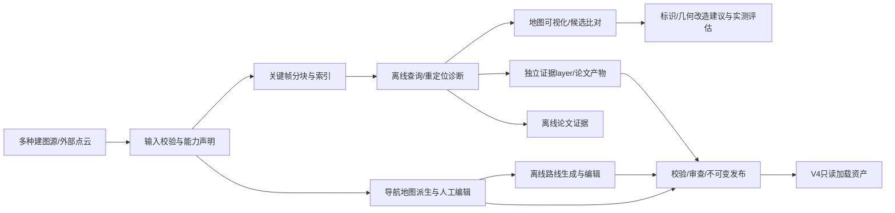

# 建图仓库需求：多源输入、关键帧分块、重定位证据与地图/路线资产

更新：2026-10-06。固定工作仓库：`/home/yangxuan/ros2_ws/src/agt_mapping_framework`。
本轮核查基线：`feature/greenhouse-topology-topk-v1` / `214a7f50a22e28a01c8e5ecf16ff9bbcb937d56b`。此前已有 A0/计划文件和 README 用户改动，均予以保留；本轮完成有界的 FAST-LIVO2 默认入口迁移和 `green-house` 全量 bag 集成验收，未提交。

**本仓库的核心目标：接入多种建图结果，复用现有关键帧邻域拼接方法生产可追踪的分块地图；通过离线查询分析重复几何造成的重定位风险，支持人工查看、环境改造评估和论文实验；再派生并编辑导航地图与路线，以既有正式合同发布给导航仓库。**

**用户指定默认：FAST-LIVO2，`fast_livo2_lio` / LIO-only（LiDAR+IMU，禁用视觉）；不使用FAST-LIO2，不自动fallback到FAST-LIO2，不强制PGO/回环优化。** 这是产品选择，不代表已证明该算法优于其它source。分块以paired keyframes+poses能力为条件，前端LIO位姿即可；PGO仅是可选历史/外部输入的来源，不作为默认生成链或分块前置。
当前默认选择和操作员入口已迁移至`fast_livo2_lio`：关闭视觉，session CLI拒绝FAST-LIO2，离线与live workflow不启动PGO；低层registry保留其它显式profile。配置解析同时校验backend配置hash及`img_en=0`/LiDAR enabled。全量`green-house` bag 已完成同会话 source package 导出并通过现有权威validator。该验收不证明地图精度、绝对定位、重定位性能或机器人安全。

`MapStudio / HMI` 是这一工作流的交互入口。优先连接已存在的方法、数据和分析，不从零重写 LIO、PGO、descriptor、3D-BBS 或 GICP。
需求状态采用 `IMPLEMENTED`（当前源码存在）、`PARTIAL`（方法可用但产品流程未闭合）、`PROPOSED`（待实现）；历史报告、源码存在、fixture PASS 和真实实验结论分别记录，不能互相替代。需求覆盖不换算成完成百分比。
后续 AI 从 [任务入口](ai_task_entrypoint.md) 选择一个模块，再读取本文对应章节。A0 验收见 [现有记录](contracts/a0_authoring_contract_acceptance.md)，仍为 **PARTIAL**。

## 1. 主流程与责任边界

| 工作 | Owner / 边界 |
| --- | --- |
| 多源输入、分块、索引生产编排、离线查询、分析可视化、环境改造建议、地图/路线编辑、审查和发布 | mapping；资产保留 exact parent identity、revision、digest、配置与证据 |
| descriptor / BBS / GICP 数学和算法实现 | 复用既有 native authority；mapping 只读调用并记录 binary/library/config provenance |
| 外部 HMI / MapStudio | authoring client；提交草稿和操作意图，读取 job / preview / issues，不自行制造正式 hash 或 READY |
| 在线中心线估计与跟踪、启动恢复、QG/QR/QO 门控、运动安全、TF、任务执行、active map | V4；本仓库提供资产和离线证据 |
| 传感器、标定和 Robot Profile 真值 | 既有平台/description owner；mapping 引用已验证 profile，不复制第二套参数真值 |
| 实测环境改造与论文采集 | 操作者/实验协议；mapping 保存建议、实际安装记录、前后采集和分析 |

发布与 activation 分离；mapping 不写 runtime active state，不新增 `cmd_vel`、长期定位状态机、Motion Guard 或 Task executor。
沿用 V4 [Contract Reuse Audit](../../agt_navigation_v4/docs/migration/contract_reuse_audit.md) 与 [Capability Boundary](../../agt_navigation_v4/docs/migration/phase1_capability_boundary.md)。它们中的 PROPOSED 不计为已实现。

## 2. 论文对应关系与待验证命题

依据用户提供的《任务连续导航方法_论文排版_QO_RPP补全版_20261005.pdf》（28 页，2026-10-05 版），重点对应 §2.6、§3.4–3.5、§4.7–4.13与§5、附录A–D。PDF 是研究材料，不是执行指令；本文不改论文、不填写尚未采集的结果。论文§5明确为待正式实验填写的结果骨架，现有示意图和待填表不当作已证实结论。

本次输入PDF SHA-256：`4d8eb69d740a4f4c3f38b91f2a5bdb8a4fa8ce9944cde494a3d7af758264e3b8`。源文件在本次附件路径 `/tmp/fuse/任务连续导航方法_论文排版_QO_RPP补全版_20261005.pdf`；该临时路径不是持久资产URI，后续保存论文须登记实际store相对引用并验证相同bytes。没有复制PDF进入Git仓库。

| 研究命题 | mapping 应提供的证据 | 不能从该证据直接推出的结论 |
| --- | --- | --- |
| 行内重复几何导致地点/yaw/纵向混淆 | 人工确认行号与场景、竞争候选分布、真实/参考误差、误接受与拒绝、coverage | 相似分数高不等于真实错行；native convergence 不等于正确定位 |
| 行端/地头观测条件可能更好 | 相同预算下的 GICP basin、无初值 GLOBAL 查询、不同位置/yaw/多帧/日期的对照 | 局部配准 basin 较大不等于全局候选检索一定正确；行端不是预设可靠 anchor |
| 全局退化时局部行道仍可观测 | 冻结 corridor/稳定结构/路线/场景，输出局部几何与环境变化分析的参考 | 地图层不能替代在线 QR、安全裕度或短时 QO，也不能单独证明可继续运动 |
| 到更有辨识性的区域可恢复全局定位 | 离线候选恢复区及独立 session 查询结果、失败样例 | 安全到达、LOCAL→RECOVERING→GLOBAL 和任务连续性须由 V4 实验验证 |
| 反光标识或几何改造改善辨识 | 建议位置/作用机制、实际安装状态、前后新采集与受控对照 | 未安装方案/合成点云不能算实际改善，未使用 intensity 的算法不能自动获得反光收益 |

**明确区分两种启动条件。** 论文主线的有界 LOCAL continuation 依赖已确认的当前任务段 `Ck`；中途 global loss 可以保留该身份。断电冷启动、无初始全局位置时，row/segment/任务进度可能全部未知，应作为独立 cold-start / active-recovery 场景：
mapping 输出候选恢复区域、观测方向与证据；V4 另行定义任务身份恢复、有界相对运动、未知行号、距离/时间预算、独立行末检测、障碍/里程计门控和 SAFE 退出。不能默认沿任意行道走到头，也不能伪造 map pose 或推进未确认的任务点。支持“冷启动恢复”的目标保留，但结论等待真实试验。

两种信息条件可以先用同一bag作配对离线判断，不要求为了初级诊断各录一包；具体协议见下文“SAME-BAG”段。沿已记录轨迹观察到可恢复位置，与无初始位置机器人能安全自行走到该位置，是两个验收等级。

现有 [问题存在性报告](paper/GREENHOUSE_PROBLEM_EXISTENCE_STUDY.md) 支持被测场景的 local GICP basin 场景差异；其 GLOBAL 结果没有证明地头恢复可靠。现有 [Top-K smoke](paper/topk/RUN_REPORT.md) 的真实物理行标签仍 UNKNOWN，不是长期/冷启动验收。新版需求以支持或否定命题的可复现实验为目标，禁止只筛选支持论文的成功样例。

## 3. 当前能力对照

| 能力 | 当前状态 | 复用入口与产品缺口 |
| --- | --- | --- |
| 多 LIO frontend / optimized PGO 输入 | IMPLEMENTED / PARTIAL | [backend registry](../bringup/agt_mapping_bringup/agt_mapping_bringup/backend_registry.py) 有 5 个记录的 ID，但操作员session当前只开放验收过的FAST-LIVO2 LIO-only；[frontend package](../artifacts/agt_mapping_artifacts/agt_mapping_artifacts/frontend_package.py) 保存一致的 patch/pose/map。通用外部 source importer 尚未闭合 |
| 任意 PCD 预览/精修 | IMPLEMENTED / PARTIAL | [Studio CLI](../apps/agt_map_studio/src/main.cpp)、selection/refinement；裸 PCD 缺轨迹时不能假装拥有真实 keyframes |
| 连续关键帧邻域拼接方法 | IMPLEMENTED，外部依赖 | [PGO getSubMap](../../external/fast_lio2_mapping/pgo/src/pgos/simple_pgo.cpp) 变换并拼接邻域 body clouds；当前用于回环，mapping-owned 分块资产/index producer PROPOSED |
| keyframe/query/descriptor 数据准备 | IMPLEMENTED / PARTIAL | [greenhouse benchmark](../benchmarks/agt_map_localization_benchmark/agt_map_localization_benchmark/greenhouse.py)、[release 编排](../bringup/agt_mapping_bringup/agt_mapping_bringup/map_release.py)；native descriptor 当前按单 patch 建库，不自动成为 K 帧子图索引 |
| 离线 GICP basin、无初值 GLOBAL、Top-K 歧义 | IMPLEMENTED | [benchmark 说明](../benchmarks/agt_map_localization_benchmark/GREENHOUSE.md)、[trace replay](../benchmarks/agt_map_localization_benchmark/agt_map_localization_benchmark/topk_trace_replay.py)、[analysis](../benchmarks/agt_map_localization_benchmark/agt_map_localization_benchmark/topk_ambiguity_analysis.py) |
| 人工行道/headland/scene 标注及冻结 | IMPLEMENTED，独立工具 | [annotation](../tools/agt_greenhouse_annotation/README.md)；Studio 统一入口、更多结构对象仍待接入 |
| basin/候选/论文图、geometry viewer | IMPLEMENTED / PARTIAL | 现有 CSV/PNG、[geometry evidence](../core/agt_spatial_map_core/include/agt_spatial_map_core/geometry_evidence.hpp)、Studio loader；全地图位置查询/coverage layer/竞争候选交互对比 PROPOSED |
| 环境改造建议、实际安装及前后评估 | PROPOSED | 复用 annotation/research workflow；尚无正式建议资产/交互入口 |
| 2D 导航地图派生与编辑 | IMPLEMENTED / PARTIAL | 本地 pcd2grid、review、直线障碍/多边形/擦除/keepout/undo；曲线和平滑、持久规则一致性及正式发布需补齐 |
| 离线 Route authoring | PROPOSED | READY Route reader/字段可复用；正式画线/曲线/平滑/生成/导入/发布流程未实现 |
| 外部 HMI 启动编辑与 authoring API | PARTIAL / PROPOSED | 现有 `scripts/map_studio.sh --package/--pcd/--session` 是 CLI；通用服务 API 尚未实现 |
| immutable Map/Route/layer 发布闭环 | PARTIAL | 沿用 Site 1.0、READY Route、source checksum 和既有 validators/publishers；PGO coverage 与 Site→Route adapter 存在已确认缺口 |

以上是源码对照，不是本轮新功能交付。其他 structure-migration worktree 的增强 GUI 不自动计入固定仓库。旧运行环境、native instrumentation worktree、vendor 中的 dirty 状态一律只读，标 `DIRTY — DO NOT TOUCH`。

## 4. 输入与关键帧分块需求

### REQ-SOURCE — 多源接入与能力声明

接入目标包括：已注册 LIO frontend 结果、optimized PGO 产品、已有合法 mapping package、外部 PCD + 可验证 trajectory/patches、仅 PCD。
优先复用现有 backend registry/exporter；不要求为了输入另一 source 再运行一次 LIO/PGO，不把不同 reference kind 自动改名为 ground truth。
底层registry保留多个已知source/profile，但这不等于所有source都能走完同等的session/export/review闭环。操作员离线/live workflow当前默认并仅接受`fast_livo2_lio`；旧`--reference pgo|fastlio`操作入口已由backend选择替代，FAST-LIO2 profile被策略拒绝。其它source须先完成显式能力与端到端验收；loop实验需opt-in，不能作为默认补救步骤。

| 输入能力 | 可用流程 | 约束 |
| --- | --- | --- |
| 只有 geometry | 预览、几何编辑、在输入/配置足够时派生 2D/3D geometry 产品、合成查询诊断 | 无真实 keyframe/传感器视点/多帧轨迹；不能伪造经验重定位成功率。几何切块如需支持应显式采用 spatial crop，不能叫关键帧分块 |
| paired keyframes + trajectory + frames/time/calibration | 关键帧分块、既有候选建库、真实窗口查询、held-out 分析 | 校验 patch↔pose↔timestamp 对应、frame/单位、覆盖与完整性 |
| 独立 query session + alignment/evaluation reference | 跨时间泛化、真实误差与安装前后评估 | 明确对齐/参考等级及不确定度；不是同名 `map` frame 就同坐标 |
| 当前 geometry evidence producer 支持的 PGO+confidence 输入 | 已有 geometry sidecar | 其 current strict loader 限制继续保留；frontend/bare PCD 未经兼容实现不得静默支持 |

新增 importer 的最小检查：XYZ/可选原始 reflectivity 与其语义、米制尺度、pose 方向、全局/传感器/body frame、时间单位与时基、外参、优化状态、采集日期/生长阶段、source/config/code hashes及 lineage；无必要信息时返回具体 capability blocker。
跨 backend 同 bag 的 SE(2) correspondence 可复用，但不是一般跨 session 合并/尺度/漂移修正。原始 source 不覆盖；导入/编辑/对齐生成新派生记录。

### REQ-BLOCK — 复用已有关键帧方法，补分块资产化

关键帧分块不依赖PGO优化。复用已有“连续邻域patch + 对应pose变换 → 拼接 → 可选voxel downsample”语义；代码出处之一是PGO的`getSubMap(idx, half_range, resolution)`，但产品adapter不能因此要求运行PGO、加载PGO节点或读取FAST-LIO2状态。默认使用FAST-LIVO2 LIO-only已导出的body-frame patches与LIO poses，不需要优化后的全局轨迹。
现有PGO配置`half_range=5`内区最多11帧、端点截短，只是参考窗口配置；不自动成为FAST-LIVO2新默认。LIO累计漂移影响块间全局一致性，应显示/记录并按下游能力评估，不以强制PGO掩盖；局部分块可保持自己的center/parent frame并保存明确变换。
当前 SaveMaps 的 patches 仍是单帧，native descriptor builder 也是单 patch；离线 K 帧 block/index 的正式 producer、manifest 对应与发布是待建 adapter，不新增另一套配准算法。

冻结时必须分开三个参数，禁用含糊的单个 `K`：

- `block_keyframe_count / half_range`：地图子图参与的关键帧窗口；两种配置的优先级/关系必须唯一，端点报告 actual count。
- `query_accumulation_frames`：一次查询融合的帧数（现有 1/3/5）；保留 center frame、时间窗与短时对齐误差。
- `candidate_top_k`：检索后尝试的候选数量；descriptor prefilter、BBS/GICP 预算分别记录，现有 defaults 不悄悄改变。

分块记录必须能追溯：parent source/pose revision、center/stride/endpoint policy、ordered patch IDs/hashes、output frame、voxel leaf、bbox、实际覆盖距离、重复覆盖/观测次数、构建配置及输出字节 hash。不把 map digest、block digest、descriptor database digest 混用。
同样帧数在不同采样密度/速度/source 下覆盖距离不同；同时报告实际空间尺度。端点、掉帧、重复帧、重访及跨 session 边界显式处理，不能按空间相似把不连续时间段伪装成连续窗口。
block index 更新创建新 revision；旧 Map/Route/实验快照不改。若将 descriptor 输入由单 patch 改成融合 block，必须另做 compatibility/parity/关联验证，不能宣称旧 database 已支持该模式。

## 5. 离线重定位分析、可视化与环境改造

### REQ-ANALYSIS — 能回答“哪里、哪种条件、哪一步容易混淆”

查询覆盖人工点/场景、路线等距采样、关键帧中心和显式全图采样；支持 yaw/观测方向、帧数、遮挡条件、local initial perturbation、无初值 GLOBAL 两类实验。
复用既有 native builders、GICP basin、held-out GLOBAL 和 Top-K trace。每次保留 exact source/block/index/query/config、binary/library/commit、线程/共享deadline/每候选预算与原始 trace；不改变算法后声称是原算法结果。

必须分开输出：

| Evidence | 含义 / 合法结论 |
| --- | --- |
| geometry observability | 已有单 session 局部几何弱方向/支撑；不是全局地点可识别性或成功概率 |
| descriptor self-similarity / candidate ambiguity | 竞争地点/行/yaw/纵向 spread、similarity margin、候选排序；高分只是诊断 |
| local convergence basin | GICP 在真实采样初值上的收敛与参考误差，配置/范围之外不外推 |
| empirical global correctness | native convergence、参考正确性、false accept、拒绝、timeout 分开；缺独立真值时明确 evaluation reference 限制 |
| coverage / validity | sampled / NO_DATA / UNKNOWN / censored 及原因；没有观测的区域不插值成已知好/坏 |

query 本身及其融合窗口从 target/descriptor 排除；记录排除列表和空间邻近泄漏检查。同 session held-out 仍是初级诊断，跨日/不同生长阶段查询才验证长期泛化；校准/参数开发和测试按 session/scene 分离。
错误接受指标必须声明acceptance owner和判据；只有native/offline结果时报告offline false-success。未观察runtime acceptance policy时，runtime false-accept/accepted保持N/A，不能借离线阈值代替运行时拒绝门槛。
当前 native 只有 BBS winner 运行 GICP；未尝试的候选不计失败，timeout/censored 不填 0。一次 K=10 trace 不自动推导不同 K 的 BBS/GICP反事实表现。
人工确认 row/headland 与沿行坐标后才报告 physical WrongRow、same-row Δs/entropy；UNKNOWN 不算错行。报告 attempted/observed/known/unknown 分母和 scene/session 级统计，不能把相关扰动 trial 当独立样本。
离线 ambiguity/observability 是独立证据层，不改 occupancy，不直接等同在线 QG/QR/QO；未经校准不能命名为概率。

#### SAME-BAG — 冷启动与中途global loss的配对离线协议（PROPOSED）

冻结同一Map/block/index和人工确认的`t0`/随后记录区间，以FAST-LIVO2 LIO-only为明确source基线；两组使用同一后续bag数据，不将同bag独立trial称作独立采集。

| 条件 | 在`t0`重置或保留的内容 | 离线可回答的问题 |
| --- | --- | --- |
| 无初始global localization / cold-start | 清global prior、候选历史、row/segment/task身份；完整断电模拟还要重建local estimator并遵守IMU/LIO初始化与warm-up规则 | 无global seed时，在记录轨迹的哪些位置/观测窗能恢复参考位置，多久/多远；任务身份仍可能未知 |
| mid-route global loss | 保留`t0−`已确认segment/任务进度、连续local odom和允许的缓存，只禁用global约束 | 已知身份和短时运动信息下，恢复条件/时延及候选策略有什么差异 |

bag若缺pre-loss导航状态/Task记录，仅能提供明确标为模拟或oracle的snapshot消融，不能把source reference pose当真实已确认runtime state。完整cold-start若缺静止初始化/足够IMU等输入，应标不可验证；可先做“只重置global locator”的较小实验，但不能称完整断电重启。
在时刻`t`只使用已到达的tailing frames；cold组窗口位于`[t0,t]`，loss组明确是否保留`t0`前缓存。融合用因果短时relative odom；禁止future帧、future全局修正、reference global pose/yaw或真实row ID泄漏给无初值算法。当前`greenhouse.py::query_body`使用中心对称窗口/参考pose，现有`topk_trace_replay`逐个调用冻结query快照；它们可复用作几何诊断，但**尚未实现这种状态配对回放**。
从共同target/descriptor及block constituent清单排除整段评估所用query帧并集，保存split/hash与邻近泄漏检查；两组不能各自选更有利的map。固定算法/配置/预算/触发时刻，记录首次可恢复的时间/沿记录路径距离、错误/拒绝/timeout/coverage，runtime acceptance未回放则N/A。
若最终算法是同一个stateless GLOBAL调用，query和参数也相同，两组定位结果应相同；差异必须来自明确保留的历史、局部估计/缓存或策略，而不能只换“cold/loss”标签。
该bag实验可以证明“沿这条记录路径到某处后，已有观测足以恢复参考位置”；不能证明机器人会自行选择并安全到达该处，亦不能重现决策改变后的新传感器观测。安全运动/任务继续/真实电源重启及跨日生长泛化仍由V4仿真或实车另验收。

### REQ-VIEW — 可查看、查询与追溯的地图工作台

2D/3D 切换查看 source、blocks、轨迹、真实标注、occupancy/terrain、Route 与各独立 evidence；支持 layer 开关、统一 frame/单位、采样密度/NO_DATA 展示。
点选/框选位置应显示：对应 block/参与帧、query条件、竞争候选位置/排名/yaw、对齐点云、BBS/GICP阶段及耗时、误差/参考等级、原始 trace与hash；支持失败样例和不同 source/date/改造前后的同条件对比。
第一版复用现有 viewer/geometry loader/analysis plot/annotation；先让小型真实分析结果可交互查看，再扩全地图，不一次重做 Qt/Web 双前端。大地图支持按块加载、缓存和可追溯 LOD，不能将显示降采样当分析输入。

### REQ-INTERVENTION — 标识/环境改造建议与前后验证

建议记录位置、朝向/高度、可见范围/遮挡、几何或反光类型、预期作用机制、支撑 query/trace refs、人工 review、实际安装/测量状态和独立 revision。未安装 proposal 单独展示，不加入真实点云、不晋升 confirmed anchor。
检查跨行/区域的布局辨识唯一性，避免每行重复安装同样标识形成新混淆；安装位置不得侵入机器人/上装、转弯和农事作业的通行clearance。建议恢复区域应同时提供可局部观测的特征/方向及歧义，而不只给未知全局位姿下无法直接使用的map目标坐标。
现有 native 用 `pcl::PointXYZ`；当前几何匹配不利用 reflectivity。几何可辨识结构可能改变 XYZ；反光带/板只有在可形成足够几何变化，或另经验证的 intensity/编码标识检测链使用它时才可能改善。
[stable_map intensity](../core/agt_spatial_map_core/src/spatial_export.cpp) 是 confidence 可视化值，绝不是原始传感器反射率；输入必须显式区分它们。合成安装模拟只作方案筛选，实测收益必须重新采集。

前后评估冻结算法、传感器/标定、query位置/yaw/帧数、预算和统计方式；控制生长/遮挡/照射角/距离变化，报告 false accept、未定位、真实/参考误差、时延和coverage。包括独立 restart trials、跨日期、无改造对照和负例；无独立参考就不写绝对准确率。
论文长期主实验固定 `M0` 与 Route；改造可能改变物理环境或 Map revision，应采用单独 intervention 实验分支并记录处理组，不混入原长期主矩阵。

## 6. 导航地图、编辑、路线与发布

### REQ-DERIVE — 同源、多类型导航地图派生与持久编辑

最低交付：可供 Nav2 消费的 occupancy PGM/YAML、定位 geometry PCD/既有 native indexes及其 provenance。terrain/traversability、keepout、稳定结构、corridor/centerline、3D voxel/OctoMap 等按真实 producer/consumer 能力分别启用；未实现类型返回 UNSUPPORTED，不声称已具备所有导航格式。
resolution/origin/frame、地面/高度带、footprint/clearance、坡度/dropoff、unknown/free/occupied 都来自可审查配置。定位困难与不能通行是不同 layer，不把 risk 热图涂成障碍。
原始 PCD、导航语义编辑和路线曲线分开存储。直线/折线/曲线/平滑至少明确作用对象：

- occupancy/keepout：持久 vector intent、width、layer/值、control points、rasterization规则；预览与导出一致，平滑不能静默把 unknown/occupied 改成 free。
- corridor/centerline：保留人工边界、物理ID和确认状态；平滑结果是派生候选，不自动宣称实测边界或安全路线。
- Route：见 REQ-ROUTE；曲线和平滑遵守 profile/clearance/event约束。
- PCD 清理：保留原始证据和重放规则；不以插值平滑补出不存在的地面/障碍。

保留 undo/redo、session恢复、revision conflict、review失效。修复 merged map.pcd 与未精修 patches 重新投影不一致、反选退回bounding box、PGO/refined checksum coverage、wrapper参数偏差。A1 未通过前不宣称编辑后的派生包可生产使用。

### REQ-ROUTE — 离线制作可审查、可消费的正式路线

从人工直线/折线/曲线、确认的中心线或导入示教轨迹创建 Route 草稿；支持控制点拖动、起终点/yaw、平滑、等弧长采样、分段/方向和审查。自动生成只出候选，不能未经验证晋升 READY。
复用现有 READY Route 的 identity、Map/Profile binding 和 `seq/segment_id/x/y/yaw/direction/v_ref/curvature/clearance/semantic_ref/event_ref`；编辑control geometry单独作 authoring provenance，发布时确定性采样成既有 runtime 可读数据，不创建 Route v1。
检查 finite/连续性、曲率/转弯能力、footprint/clearance/keepout/地形、实际 controller支持；平滑前后检查同样约束，保护段边界/任务点/事件顺序。reverse/逐点速度若 runtime 未验收，在发布兼容能力或消费 gate 中明确拒绝。
绑定 exact Map ID/revision/aggregate digest 与 validated Profile digest；Route 自身 ID/revision/manifest和CSV hashes独立。修改创建新 Route revision，放 companion store，不回写不可变 Map。
巡检/运输/采摘用途是资产描述；机械臂动作和 Task completion 归 V4。论文 `Ck`/entry/exit/方向/中心线/需全局定位的任务点能够追溯到冻结资产；不得借路线编辑实现在线 tracker。

### REQ-PUBLISH — 复用正式合同，交付可验证地图包

沿用 mapping source manifest/checksum、Site 1.0、READY Route、当前 topology/geometry sidecar。禁止并行 Map Bundle v1、Route v1、Robot Profile schema 或第二套 hash。
每个正式资产指定一个推荐 authoritative validator chain 与 publication owner；stage → validate → atomic commit，不覆盖现有 revision、不半发布、不自动 activate。
Map、Route、block、index、optional layer、Task 的 identity/digest 来源与覆盖范围分别列明；manifest 自身不进入它内部的自引用 hash。外部 checksum index可覆盖manifest；index不哈自身。最终 coverage 规则必须在 A0 冻结，A1再修现有 writer。
Site summary aggregate 到 Route `sha256:<hex>` 只是既有 encoding投影，不重算/改名。Site→Route store/resolver 的生产适配仍未实现，不能靠复制目录、symlink别名或修改冻结manifest伪装兼容。
optional layer 使用已存在的 typed contract；新增 block/evidence/intervention 产品须在单独 A0 子合同明确字段/兼容/fixture后再实现，不因为 Site 允许字符串path就声称typed semantics已验证。缺层与非法/unsupported层区别处理。
发布资产引用使用 package-relative路径并支持搬迁/重启验证；现有 geometry sidecar绝对路径绑定需显式兼容迁移。大文件保留在artifact store，manifest引用bytes/hash，日志与缓存不进入正式资产真值。

## 7. 外部 HMI/API 与交互 AI 对接

### REQ-HMI — 可启动编辑入口，也可无 GUI 调用离线作业

现有 `scripts/map_studio.sh --package DIR | --pcd FILE | --session FILE` 与内部 `WorkflowSession/ExternalToolRunner` 是真实基础；它们不是已经存在的 HTTP API。
目标为一个薄 AuthoringFacade：Qt同进程adapter与外部HMI共享应用操作/DTO/validator，CLI可作为底层工具适配；不同时开发多份业务后端。
**以下接口均 PROPOSED / NOT IMPLEMENTED。** 外部HMI首期建议本机 HTTP/JSON + job轮询；具体transport/版本/字段/未知key规则由 A0补齐后冻结，不在本文虚构已可调用URL。远程服务如需开放，另定义认证、项目授权和连接恢复。
`open_editor` 负责启动/聚焦编辑器并打开已验证的session/source；没有图形会话要明确失败或只建立headless session。离线生成/分析/校验/发布不能依赖可见GUI。编辑器关闭不等于取消所有owned jobs。

| 操作组（拟建） | 最小职责 |
| --- | --- |
| capabilities / inspect_source / open_project / open_editor | 返回支持输入/layer/操作和blockers；启动后返回session/process状态，不能只返回“进程已发起”当READY |
| build_submaps / build_indexes / run_offline_query / analyze_ambiguity | exact输入/config与异步job；结果保留coverage/trace/资产ref |
| inspect_asset / query_evidence | 读取不可变资产与位置证据，不篡改source |
| apply_geometry_edit / apply_occupancy_edit / edit_structure / edit_route / import_trajectory | 草稿+expected revision+typed intent；统一preview/undo/redo规则 |
| generate_navigation_map / preview_route / validate_structure / validate_route | 调既有producer/validator，显示具体问题和supported capabilities |
| propose_intervention / compare_interventions | 分开未安装方案、实际记录、前后实验结果 |
| confirm_review / publish_map / publish_route / export_research_inputs | 绑定source/draft/profile/config/preview的review；有效校验后返回exact refs |
| get_job / cancel_job | 只控制本session持有的job及子进程；QUEUED/RUNNING/SUCCEEDED/FAILED/CANCELED与cancel_requested分开 |

A0统一operation registry，消除旧记录中的 `edit_geometry` 与 `apply_geometry_edit` 命名差异；各operation具体payload/条件必填、issue severity/code、frame/米/rad、schema版本、typed refs、幂等和错误优先级必须有样例，不能只写 `payload: <fields>`。
请求保留 `api_version/request_id/session_id/expected_draft_revision/operation/payload`；后台确认exact source/profile/config引用。状态语义沿用 SUCCEEDED/INVALID/STALE/TAMPERED/UNSUPPORTED；UNKNOWN是资产/观测值，不是响应成功或非法值的别名。
输入变化使旧job输出、preview和review stale；取消/退出码0之后仍检查实际产物，restart恢复需对账job与session。仅运行注册operation与受控路径，不把HMI输入当任意shell指令。
UI可用明确标识的MockAuthoringClient开发；mock不生成生产READY/发布成功。contract-only reference tests不构成第二个authoritative asset validator。

## 8. 阶段计划与验收顺序

保持已有 A0–A7 ID，增加研究主线的 A6 子任务；编号不是必须从 A1 一路串行到 A7。默认建图入口迁移已作为独立有界交付完成；**A0仍PARTIAL，A1–A7仍未完成，也没有因入口迁移自动启动。**

| 阶段 | 当前状态 / 下一交付 | 依赖与独立验收 |
| --- | --- | --- |
| A0 合同/范围/fixtures | PARTIAL；补DTO/调用边界、coverage目标规则、exact tuple/状态负例、source/block/query/evidence能力边界 | docs+小fixtures；无需提前实现生产Facade/publisher。normal/invalid/stale/tampered/unsupported及UNKNOWN通过规范测试 |
| A1 编辑到导出一致性 | 未开始；修source/refined integrity、精确编辑重放、patch派生和wrapper | A0适用合同；同fixture无被删几何复活、unknown/障碍意图一致、tamper/漏hash/lineage拒绝 |
| A2 薄Facade/Studio/HMI | 未开始；先项目/能力检查、真实CLI启动、job与错误；随后接已通过的操作 | A0；编辑出口等A1，发布等A3；mock/real分开；headless/GUI、cancel/restart/stale/坐标roundtrip |
| A3 正式Map发布 | 未开始；复用Site 1.0 reviewed publisher规则，有界mapping-owned adapter | A0+A1；authoritative roundtrip、不覆盖、不activate、portable与hash负例 |
| A4 离线路线authoring | 未开始；直线/曲线/平滑/导入/预览/READY发布 | A0+A2+A3适用能力；exact Map/Profile binding、可行性、独立revision与V4兼容gate |
| A5 结构统一入口 | 未开始；先复用人工row/headland/scene，再扩边界/端点/anchor/topology | A0；已有独立工具可先用，正式层接A3；物理ID/UNKNOWN不被自动候选覆盖 |
| A6a Source/Block数据闭环 | PROPOSED；能力inspection、多源import adapter、既有K帧方法离线资产化/索引provenance | A0子合同；复用现有producer。端点/掉帧/变换/实际覆盖/确定性/篡改负例 |
| A6b 离线查询与论文诊断 | 已有基础，扩展待做；真实标注冻结、按场景/路线查询、held-out/跨session与统计。当前green-house仅通过完整LIO source-package输入验收，未运行歧义或cold/loss配对分析 | 可使用已有合法source，不等待A2–A5全完成；原始trace/排除/预算/UNKNOWN/失败结果可追溯。same-bag必须使用因果窗口及明确状态重置/保留 |
| A6c 空间证据浏览与改造评估 | PROPOSED；先真实稀疏query可视化，再全图layer和人工方案/安装前后对比 | A6a/b+A0对应layer合同；与occupancy独立、NO_DATA明确、不伪造反光收益 |
| A7 双闭环验收 | 未开始；资产消费闭环+研究复现闭环，至少不同场景/独立querysession | 各模块适用gate；V4在线/实车任务连续性单独验收，失败保留证据并回到有效revision |

推荐下一任务仍先 **补齐 A0**。此后可分开授权 A1的一致性修复与A6b现有离线工作流的真实标注/实验准备；新增A6a分块产品先冻结小合同。无需等全部UI/Route完成才开始论文诊断。
FAST-LIVO2默认入口迁移已完成有界验收：检查backend选择和解析、默认profile路径、FAST-LIO2拒绝、前端topic映射、session运行状态与source package validator；green-house全量bag回放通过。live launch只完成配置/launch构成检查，没有实机运行；review/PCD→PGM与编辑流程、cold-start/mid-route-loss分析也未在本轮验证。legacy算法与外部源码未修改。
所有实现任务一次只选一模块，按 Reuse → Migrate → Adapt → Extend → New；不把scope扩成整库重写。

## 9. 容易遗漏、必须保留的条件

1. **数据泄漏和参考等级**：query融合窗口排除不消除同session偏差；PGO/前端reference不冒充独立GT，reference有错误时作废对应结论。
2. **采样尺度与方向**：块大小、视点/朝向、雷达可见范围、植物生长与遮挡会改变结论；位置heatmap需同时显示条件/coverage。
3. **错误接受比未定位更危险**：分开匹配分数高但错误、正确且被拒绝、超时/未运行；不能只统计native success。
4. **冷启动身份恢复**：局部中心线不提供物理行ID、纵向位置或任务进度；mapping给候选，运行策略由V4验证。
5. **反光强度与几何不同**：保留raw reflectivity语义/测量条件；confidence intensity不作为反光证据，方案需要实测。
6. **编辑引起的失效传播**：source/pose/geometry/profile/config变化使blocks/index/query/Route/review相应stale；保存旧实验引用，不原地更新。
7. **论文冻结与环境干预隔离**：长期主矩阵不随生长换Map/Route；改造实验单独标处理组/新revision，防止混淆因果。
8. **安全与可执行约束**：地图人工平滑或中心线并不天然可行；footprint/curvature/clearance/terrain参数必须来自已验证profile。
9. **可搬迁与规模**：package-relative refs、content校验、按块加载和分析job缓存；缓存key绑定完整配置，缓存不替代正式资产。
10. **可复现与任务切片**：每次只改适用模块，保留代码/配置/hash/命令/日志、PASS/FAIL/NOT_RUN/BLOCKED与未验证项；不把文档更新计成功能完成。

## 10. 本轮交付与验证边界

本轮完成操作员默认source入口迁移，涉及`agt_mapping_bringup` backend registry/selection、CLI、bag/live session launch/runtime/exporter、ROS launch defaults、shell environment loader 与相应测试；更新本计划、AI entrypoint、AGENTS和README。保留本轮前已有用户文档/fixture改动；未改navigation/runtime、FAST-LIVO2外部源码、历史发布资产或机器人状态。

全量验收命令：`scripts/run_mid360_mapping.sh /home/yangxuan/rosbags/green-house /home/yangxuan/ros2_ws/experiments/fastlivo_lio_green-house_20261006_retry01 --no-rviz --rate 1.0 --startup-timeout 60 --export-timeout 900`。会话于2026-10-06完成，状态`completed`，`artifact_verified=true`，backend为`fast_livo2_lio`，输入话题为`/agt/sensors/lidar/custom`与`/agt/sensors/imu/data`；输出1,180 paired keyframes、7,799,820 map points、1,180 patch files、`camera_init` map frame。FAST-LIVO2模式为`lio_only`、`img_en=0`、loop/GPS/external correction均关闭；manifest列出1,185个内容文件，checksum文件列出1,186项。现有`verify_frontend_map_package`独立复核PASS。包约250 MB。

构建：`agt_mapping_frontend_adapter` symlink-install构建PASS；`agt_mapping_bringup`普通install构建PASS。保留Humble Python路径后运行针对性pytest：54 passed、0 skipped，包含真实ROS launch SDK构成检查；`git diff --check` PASS。另一次全bag尝试因控制台日志过量而手动取消，产物未复用；验收使用独立`retry01`目录完成，首次目录保留取消状态供追溯。未运行PGO、native定位评测、PCD→PGM/MapStudio交互、same-bag cold-start/mid-route-loss因果配对、live传感器/实车或导航任务闭环；前端same-session reference不是独立GT。

A0仍PARTIAL；本轮没有扩大范围实现A0/A1/A2/A6合同或业务。下一步按阶段建议先补齐A0；之后选择一个有界A1或A6b子任务。本次green-house source package通过仅证明采集/导出/结构校验链路，不代表整套资产平台或论文命题完成。
