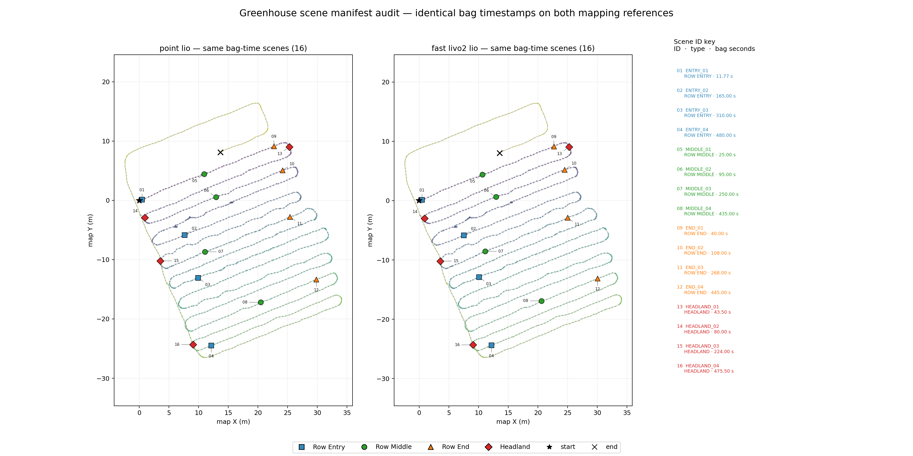
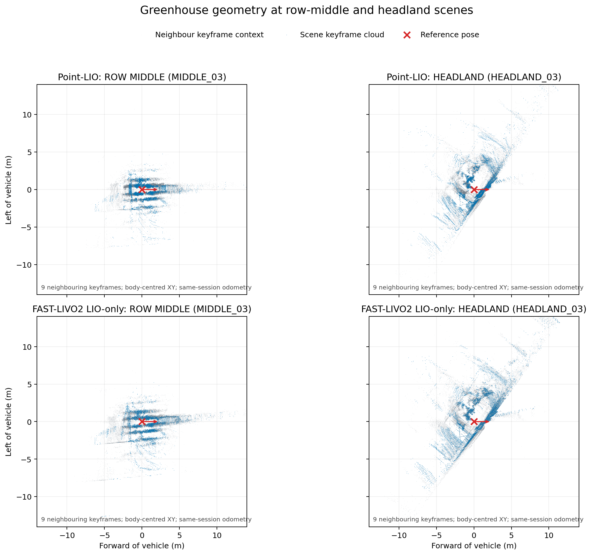
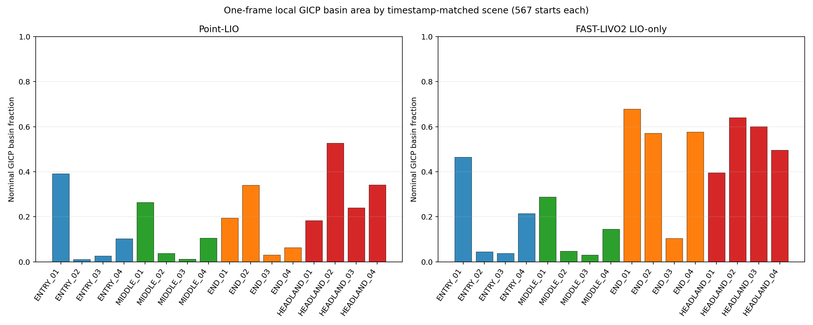
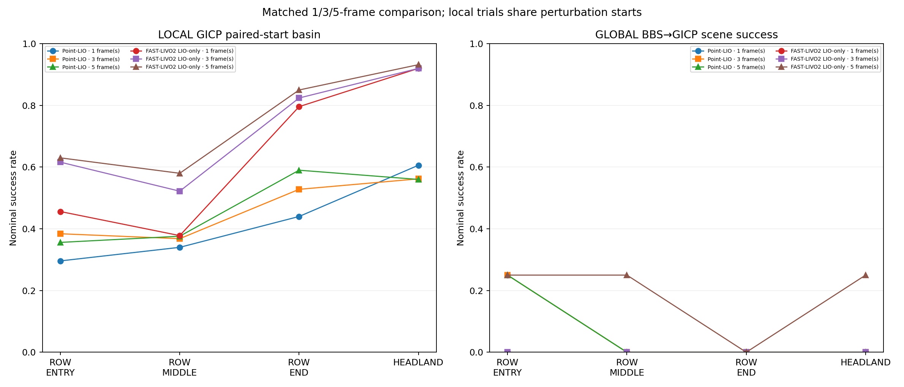
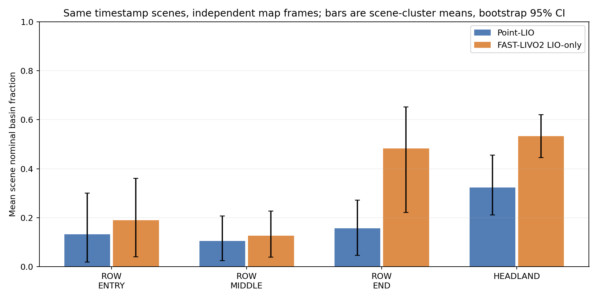
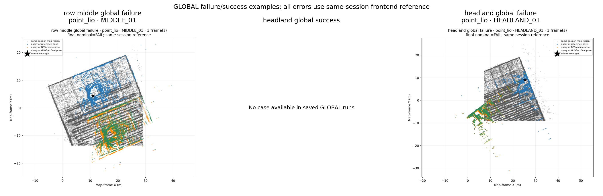

# 1 Research question

This experiment asks whether a tomato greenhouse with repeated parallel rows has state-dependent localization difficulty: whether local registration has a larger convergence basin near row ends and headlands than in row interiors, whether temporal accumulation changes that basin, and whether the scene effect appears under two repeatable LIO mapping backends.

It is a problem-existence study for an architecture that maintains local task execution in rows and attempts global recovery at informative semantic states. It does not evaluate a proposed recovery policy.

# 2 Why this experiment is not a method benchmark

The experiment measures the behavior of frozen mapping references and a frozen descriptor → CPU 3D-BBS → GICP pipeline. It does not modify the LIO estimators, BBS, or GICP, and it does not tune parameters per scene or backend. No PGO, GPS factor, or external global correction was used.

All pose comparisons use same-session frontend maps as references. These maps are repeatable references, not absolute ground truth. The success rates therefore describe agreement with those references under the stated thresholds, not absolute localization accuracy.

# 3 Dataset / robot / sensor

The input is the ROS 2 SQLite bag at /home/yangxuan/rosbags/green-house. Its metadata reports 622.994 seconds, 6,230 Livox CustomMsg LiDAR messages, and 124,600 sensor_msgs/Imu messages. The mapping profiles identify the sensor configuration as Livox Mid-360. The bag metadata itself does not identify chassis model or physical row IDs.

| Item | Point-LIO reference | FAST-LIVO2 LIO-only reference |
|---|---|---|
| LiDAR topic in bag | /agt/sensors/lidar/custom | /agt/sensors/lidar/custom |
| Mapping input type | sensor_msgs/PointCloud2 adapter output | livox_ros_driver2/CustomMsg |
| Point time field | time, seconds relative to header | points.offset_time, nanoseconds relative to header |
| IMU topic/type | /agt/sensors/imu/data, sensor_msgs/Imu | /agt/sensors/imu/data, sensor_msgs/Imu |
| LiDAR/body frames | livox_frame / body | lidar_link / livox_imu |
| Map frame | camera_init | camera_init |
| T_body_lidar translation | (0.011, 0.02329, -0.04412) m | (0.011, 0.02329, -0.04412) m |
| T_body_lidar quaternion | (0, 0, 0, 1), XYZW | (0, 0, 0, 1), XYZW |

The sensor topics and extrinsic values match in the saved map metadata; message conversion, point-time representation, and body/LiDAR frame names differ. Those frontend-stack differences remain part of the cross-backend comparison. We compare scene-effect direction and do not compare absolute map coordinates.

Both map packages state same-session frontend odometry, pgo_applied=false, optimized=false, and absolute_ground_truth=false. A generic run-manifest PGO label was stale boilerplate; the validated map-package metadata and loader checks establish that PGO poses were not used.

# 4 Mapping reference selection

Each backend has three independent replays. Both meet the frozen REPEATABLE classification thresholds: XY P95 ≤ 0.5 m, yaw P95 ≤ 5 degrees, and 0.5 m XY occupancy IoU ≥ 0.80 for every replay pair.

| Backend | Worst pairwise XY P95 | Worst pairwise yaw P95 | Lowest occupancy IoU |
|---|---:|---:|---:|
| Point-LIO | 0.0867 m | 3.42° | 0.9098 |
| FAST-LIVO2 LIO-only | 0.0809 m | 3.86° | 0.9296 |

These checks establish replay consistency for this bag, not physical correctness. The replay classification cutoff was applied after an exploratory Point-LIO run-1/run-2 comparison; the raw pairwise values are retained in Table 1 and the cutoff is not presented as preregistered.

The references contain 1,180–1,187 Point-LIO keyframes and 8.48–8.53 million map points; FAST-LIVO2 contains 1,162–1,184 keyframes and about 7.65–7.82 million map points across recorded runs. The per-run resource and native-latency records are in the supplementary CSVs. Point-LIO did not emit native per-scan processing latency in the captured logs. FAST-LIVO2 native timing was available for two runs only, so it is not a like-for-like latency comparison.

The backend source/configuration audit is in tables/backend_reference_config.csv. Point-LIO used source commit a8e2d0d; FAST-LIVO2 used source commit 1e96f08. The experiment used the recorded mapping artifacts and pre-existing executables; it did not rebuild or alter either estimator for this study.

# 5 Scene definition

Sixteen scenes were frozen from bag timestamps: four ROW_ENTRY, four ROW_MIDDLE, four ROW_END, and four HEADLAND. The same bag timestamps were applied to both map references; maximum nearest-keyframe time offset was 0.2912 seconds. Query windows were excluded from generated target and descriptor maps.

Physical row identity is UNKNOWN for every scene. The trajectory-pass labels are provisional ordinal groups used only for analysis, not physical row ground truth. Scene selection was manually checked against the complete time-colored trajectories and aisle-axis extrema; confidence is low-to-medium for entry, middle, and row-end labels and medium for headland turns.

# 6 H1 repeated-row ambiguity

**OBSERVED.** In the no-initial-pose GLOBAL experiment across all three frame counts, row-middle final nominal success was 1/12 for FAST-LIVO2 and 0/12 for Point-LIO. Headland success was also sparse: 1/12 for FAST-LIVO2 and 0/12 for Point-LIO. At one frame, neither backend had a final nominal success for row-middle or headland.

The saved candidate’s nearest frozen trajectory-group proxy differed from the query group in 4/11 known row-middle candidates and 9/10 known headland candidates. This proxy is not a physical-row label and does not establish a wrong-row candidate. The full descriptor Top-K scores, candidate spatial spread, and normalized score margins were not emitted by the installed localizer.

**INTERPRETATION.** GLOBAL recovery is weak on this dataset, but these outputs do not show that row-middle is more ambiguous than headland. The available candidate-group proxy does not have that ordering.

**HYPOTHESIS STATUS: NOT_TESTED.** Repeated-row ambiguity itself needs full candidate rankings and physical row labels before it can be claimed.

# 7 H2 headland observability

**OBSERVED.** On the full one-frame local GICP grid, nominal basin fraction is the mean success fraction across four frozen scenes of each type. Each scene has 567 starts; each backend has 9,072 full-grid trials. Nominal success requires translation error ≤ 0.5 m and yaw error ≤ 5° against the same-session reference.

| Backend | ROW_MIDDLE | HEADLAND | HEADLAND − ROW_MIDDLE | Scene-bootstrap 95% CI |
|---|---:|---:|---:|---:|
| Point-LIO | 10.5% | 32.3% | +21.8 percentage points | +5.9 to +37.7 pp |
| FAST-LIVO2 LIO-only | 12.7% | 53.3% | +40.6 percentage points | +25.9 to +53.4 pp |

The bootstrap resamples four scene IDs within each semantic class, not individual perturbations. Strict and loose thresholds are also retained in the CSV; Point-LIO’s strict headland-minus-middle effect is smaller and its interval crosses zero.

**INTERPRETATION.** For these frozen queries, headland local registration has a larger nominal GICP convergence basin than row-middle under both repeatable mapping references. Basin area is an observability proxy; it is not a direct measurement of physical information or a guarantee of global recovery.

**HYPOTHESIS STATUS: SUPPORTED** for the stated local-basin proxy.

# 8 H3 multi-frame temporal context

**OBSERVED — LOCAL.** The paired grid has 125 identical perturbation starts per scene and frame count, or 500 paired starts per semantic class. From one to five frames, FAST-LIVO2 row-middle nominal success rose from 37.8% to 58.0% (104 improved, 3 degraded pairs). Point-LIO row-middle rose from 34.0% to 37.6% (44 improved, 26 degraded). Headland behavior was backend-dependent: Point-LIO fell from 60.6% to 56.0% (50 improved, 73 degraded), while FAST-LIVO2 moved from 92.0% to 93.2% (13 improved, 7 degraded).

**OBSERVED — GLOBAL.** Point-LIO had the same final-success outcomes at one and five frames. FAST-LIVO2 gained one successful frozen scene each in ROW_ENTRY, ROW_MIDDLE, and HEADLAND at five frames; ROW_END did not improve. Across all frame counts, each backend still had only 3/48 final nominal successes.

**INTERPRETATION.** Temporal accumulation can improve local registration, particularly for FAST-LIVO2 row-middle queries, but it is not uniformly beneficial across backends and scene classes. GLOBAL gains are sparse.

**HYPOTHESIS STATUS: PARTIALLY_SUPPORTED.**

# 9 H4 cross-backend invariance

**OBSERVED.** Both repeatable backends have the same nominal local scene-type ordering: HEADLAND > ROW_END > ROW_ENTRY > ROW_MIDDLE. The HEADLAND-versus-ROW_MIDDLE effect is positive in both backends, with the estimates and scene-bootstrap intervals shown in Section 7.

**INTERPRETATION.** The measured local scene effect is replicated across these two mapping references and is less likely to be an idiosyncrasy of one estimator. Because their input conversion and frame conventions differ, this is replication of effect direction, not a controlled comparison of absolute estimator accuracy.

**HYPOTHESIS STATUS: SUPPORTED** for the tested local scene ordering.

# 10 GLOBAL relocalization limitations

**OBSERVED.** With no manual initial pose, coarse pose availability was 13/48 for Point-LIO and 21/48 for FAST-LIVO2. Final nominal BBS→GICP success was 3/48 for each backend (6/96 combined). Headland final success was 0/12 for Point-LIO and 1/12 for FAST-LIVO2 across frames 1, 3, and 5.

The installed localizer did not save full Top-K descriptor rankings or score margins; normalized-margin valid count is zero. Candidate trajectory-group comparison is only an ordinal proxy because physical row IDs are UNKNOWN. It is prohibited to report a physical wrong-row rate from these data.

Run manifests contain stale generic text suggesting same-session PGO, but both validated input map packages declare pgo_applied=false and optimized=false, and the loader checked those fields. The benchmark used frontend odometry references only.

**INTERPRETATION.** The current frozen BBS→GICP pipeline is too unreliable to establish headland-triggered global recovery as deployable. This does not negate the local-basin result; it identifies candidate retrieval and validation as an unresolved bottleneck.

# 11 Failure case analysis

Three row-middle GLOBAL failures and two headland GLOBAL failures were saved with query cloud, selected candidate patch where available, map region, reference/coarse/final transformed clouds, error metadata, and top-down alignment PNGs. No headland GLOBAL success was available, so a headland-success case could not be selected.

The most severe inspected example is Point-LIO HEADLAND_01 at one frame: BBS coarse error was 26.74 m and 103.41°, and final error was 26.38 m and 104.62° against the same-session frontend reference. Its candidate trajectory-group proxy differs from the query group, but this is not a physical wrong-row determination.

The three row-middle examples include Point-LIO MIDDLE_01 (final XY error 15.94 m) and FAST-LIVO2 MIDDLE_04 and MIDDLE_02 (4.37 m and 4.10 m final XY error). These represent failed GLOBAL alignments, not labeled physical row confusions.

Per-case point clouds and metadata remain in /home/yangxuan/ros2_ws/experiments/greenhouse_problem_existence_20261003/failure_cases. The repository copy contains case summaries and top-down PNGs; large PCDs are kept with the raw experiment outputs.

# 12 Evidence supporting the thesis topic

**OBSERVED.** Repeatable Point-LIO and FAST-LIVO2 references both show a larger nominal local GICP basin at headlands than in row-middle. The direction and scene-type ordering replicate across the two backends. The frozen GLOBAL pipeline frequently fails even at headlands.

**INTERPRETATION.** These data support studying a system that preserves local row operation and requests global recovery in semantic states with a larger local registration basin. They also motivate improving candidate retrieval and validation before expecting reliable global recovery.

**HYPOTHESIS.** Event-triggered recovery may reduce dependence on continuous global localization and manual intervention. No trigger policy, task-continuity controller, or manual-intervention metric was evaluated here.

# 13 Evidence against / limitations

- H1 repeated-row GLOBAL ambiguity is NOT_TESTED because complete Top-K scores/spread and physical row labels are missing; the available ordinal proxy does not show row-middle as more mismatched than headland.
- The GLOBAL final-success rate is only 6/96 across backends and all frame counts. Headland success is 1/24 combined.
- There is one bag/session, 16 scenes, and only four scenes per semantic class. Repeated perturbations are correlated; bootstrap uncertainty is based on scene IDs.
- Same-session frontend references are not absolute ground truth. Physical row IDs are UNKNOWN.
- The replay repeatability threshold was classified after an exploratory Point-LIO pair; raw metrics are reported.
- Backend input message conversion, point-time field, and frame names differ. Cross-backend claims are limited to scene-effect direction.
- Point-LIO native processing latency was not emitted. FAST-LIVO2 native latency was captured in two of three runs only; no backend-to-backend latency claim is made.
- Long-term, cross-day, cross-season, cross-growth, and changing-light robustness are NOT_VERIFIED.
- The results do not establish paper novelty, field deployment safety, reduced intervention, or successful task continuity.

# 14 What is still missing for publication

1. Re-run GLOBAL localization with an instrumented build that preserves complete Top-K scores and poses, candidate spatial spread, and reproducible score margins.
2. Add independently labeled physical row identities and an external pose reference or carefully designed loop-closure truth for candidate correctness.
3. Repeat across independent bags, days, growth stages, and lighting conditions.
4. Implement the local-task/global-recovery state machine, then measure trigger precision/recall, recovery time, false triggers, task completion, and human interventions against continuous-GLOBAL and no-recovery baselines.
5. Test safety and operational constraints on the intended robot before making deployment claims.

## Core tables

- [Table 1 — Mapping repeatability](tables/table1_mapping_repeatability.csv)
- [Table 2 — Frozen scene definition](tables/table2_scene_definition.csv)
- [Table 3 — Local GICP basin by scene](tables/table3_gicp_basin_by_scene.csv)
- [Table 4 — GLOBAL BBS→GICP by scene](tables/table4_global_bbs_gicp_by_scene.csv)
- [Table 5a — Paired LOCAL multi-frame](tables/table5_multiframe_local_paired.csv)
- [Table 5b — Paired GLOBAL multi-frame](tables/table5_multiframe_global_paired.csv)
- [Table 6 — Cross-backend scene effect](tables/table6_cross_backend_scene_effect.csv)

## Figures

- [Figure 1 — Trajectory and scene states](assets/fig01_greenhouse_trajectory_and_scene_states.png)
- [Figure 2 — Row-middle and headland geometry](assets/fig02_row_middle_vs_headland_geometry.png)
- [Figure 3 — GICP basin comparison](assets/fig03_gicp_basin_scene_comparison.png)
- [Figure 4 — BBS candidate availability and GLOBAL outcomes](assets/fig04_bbs_candidate_ambiguity.png)
- [Figure 5 — Multi-frame ablation](assets/fig05_multiframe_ablation.png)
- [Figure 6 — Cross-backend scene effect](assets/fig06_cross_backend_scene_effect.png)
- [Figure 7 — GLOBAL failure examples](assets/fig07_failure_case_wrong_place_or_wrong_basin.png)

Supplementary local sensitivity views: [row-middle XY basin](assets/gicp_basin_heatmap_row_middle.png), [headland XY basin](assets/gicp_basin_heatmap_headland.png), [XY sensitivity](assets/gicp_basin_xy_sensitivity.png), and [yaw sensitivity](assets/gicp_basin_yaw_sensitivity.png).
