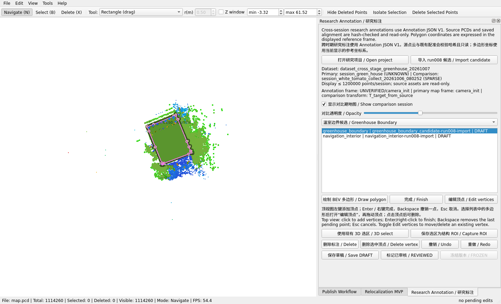
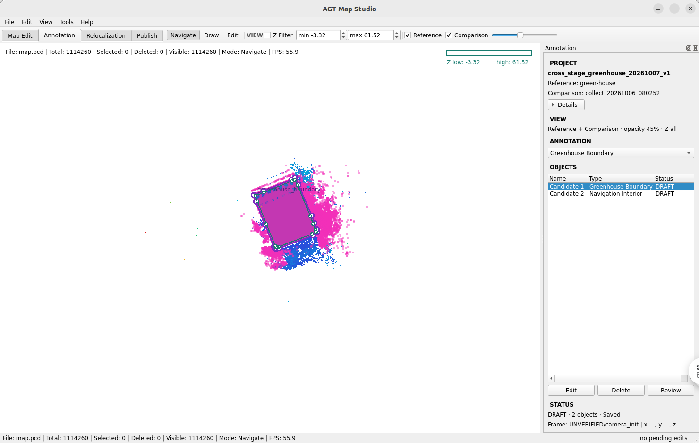
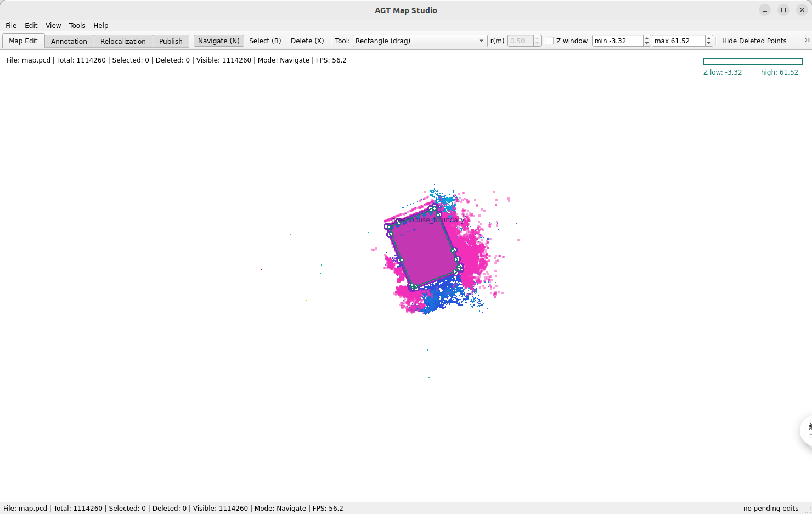

# MapStudio UX Cleanup V1

MapStudio now presents four workspaces over one shared `PointCloudViewer` and the existing project/annotation model. The cleanup changes interaction visibility and labels; it does not add algorithms or alter Annotation JSON V1, the Research Asset Contract, source maps, or experiment results.

## Before and after

| Before | After: Annotation | After: Map Edit |
| --- | --- | --- |
|  |  |  |

The before image shows Map Edit selection/deletion controls and all annotation lifecycle and geometry actions at once. The after image keeps the Annotation tools focused on drawing and editing, while the Map Edit screenshot retains the point-cloud editing tools in its own workspace.

## Workspaces

- **Map Edit** shows the point-cloud Navigate / Select / Delete modes and point-selection tools.
- **Annotation** shows Navigate / Draw / Edit, Z Filter, reference/comparison visibility, and comparison opacity. The right panel groups `PROJECT`, `VIEW`, `ANNOTATION`, `OBJECTS`, and `STATUS`. Project details such as IDs, hashes, frames, and transform are collapsed under **Details**.
- **Relocalization** shows the existing relocalization panel with the same viewer.
- **Publish** shows the existing publishing workflow. Opening the 2D navigation map switches to this workspace.

Only the active workspace's tools and panel are shown. `run008`, `run009`, and other experiment run numbers are not shown in the daily Annotation view; candidate provenance remains in the saved annotation asset and advanced Details.

## Annotation workflow

1. Open **File → Open Research Annotation Project...** and select the project's `project.json`. MapStudio verifies the existing project, source hashes, alignment, session binding, and Annotation JSON V1 before loading the maps. The project opens read-only with respect to its source point clouds.
2. Select the **Annotation** workspace. The type selector opens on **Aisle** and lists **Topology** first. When Aisle is selected, the panel shows **Auto Extract Aisle + Ends** and the top toolbar action is **Draw Aisle**. Other types remain available in the grouped selector. Geometry follows the type: Environment regions use Polygon, stable structures use the existing 3D Selection, Centerline uses Polyline, and Row Entrance / Aisle End use Point.
3. For an automatic aisle proposal, leave the type selector on **Aisle** and click **Auto Extract Aisle + Ends**. The action reads the primary/reference point cloud and the saved Greenhouse Boundary polygon. If the view is set to Comparison only, MapStudio explains the source and switches to Reference only so candidates are visible over the cloud that generated them. Set the Z interval, profile bin, minimum row spacing, estimated row half-width, side clearance, minimum and maximum aisle width, and minimum length; Z starts from the Annotation toolbar values. It estimates row direction from long, supported parallel density ridges in the filtered point cloud instead of assuming that rows follow the greenhouse boundary's long axis. It shows the estimated direction and score separation before adding candidates, and rejects weak or competing directions. Each corridor receives separate start and end point annotations. Review the count and direction before adding the whole batch. Results are editable `DRAFT` / `PROVISIONAL` annotations bound to the primary session hash; they are not ground truth and do not decide whether a region is traversable. Inspect and edit the polygons and endpoint markers before Save or Review. One Undo removes the generated batch. This MVP does not classify obstacles or assign harvested/vegetation semantics.
   For manual aisle work, select **Draw Aisle**. Click polygon vertices and press Enter, right-click, or click **Finish Aisle** to complete; Esc cancels and Backspace removes the last pending vertex. For other Polygon or Polyline types, the same drawing workflow uses the generic Draw / Finish actions. For Point, click once. For a stable structure, drag a 3D region using the existing selection tool and Z filter if needed, then select **Capture**.
4. Select an object in the `Name | Type | Status` list. An aisle shows the contextual **Edit Aisle** button; other editable XY geometry shows **Edit**. Drag a vertex to move it; in Edit mode, select a vertex and press Delete to remove that vertex. Use the selected object's **Delete** button to remove the whole annotation. The Map Edit point-delete action is hidden in this workspace.
5. Use **Ctrl+Z / Ctrl+Y** for Undo / Redo. Save with **Ctrl+S** or the conditional **Save** button, which appears when there are unsaved changes.
6. For lifecycle review, select a `DRAFT` object and choose **Review**, then enter the reviewer name. After every object is `REVIEWED`, select a reviewed object and choose **Freeze**. A frozen revision is read-only. A draft or reviewed annotation is not treated as paper truth by the independent Research Asset Contract gate.

The Details disclosure contains dataset/session IDs, hashes, frame names, transform direction/matrix, and imported-candidate provenance. It is collapsed by default. Candidate objects use short UI names such as `Candidate 1`; source candidate IDs and provenance stay in the asset.

## Map Edit workflow

1. Select **Map Edit**. Open a PCD or mapping package through **File**. The Annotation and Relocalization panels are hidden while the point-cloud tools are active.
2. Use **Navigate** to inspect the cloud. Choose **Select** and a selection geometry (rectangle, polygon, or sphere), then select points. The optional Z window restricts height-based selection; the sphere radius applies to sphere selection. **Hide Deleted Points** and **Isolate Selection** are available here.
3. To remove selected cloud points, switch to **Delete** and use **Delete Selected Points** or the Delete shortcut. This point-cloud action is not exposed in Annotation. Use **Ctrl+Z / Ctrl+Y** to undo or redo point edits.
4. Select **Publish** or open the 2D map to use the existing occupancy editing and publishing workflow.

## Visible-control count

Counts are taken from the before and after screenshots. A control is a clickable action or one visible selector, list, checkbox, spin box, or slider; menus, labels, status text, and the workspace tab strip are reported separately.

| Annotation view | Before cleanup | After cleanup, with Aisle selected |
| --- | ---: | ---: |
| Always-visible action buttons (3D mode actions plus annotation push buttons / Details disclosure) | 20 | 4 |
| Contextual Aisle action | 0 | 1 automatic proposal action |
| Contextual object actions (Edit / Delete / Review or Freeze) | 0 | Up to 3 |
| Other visible controls (selectors, lists, toggles, sliders, spin boxes) | 9 | 6 |
| Total task controls, excluding workspace tabs | 29 | 14 when Aisle is selected; 13 for other annotation types |

The cleaned Annotation view keeps task controls compact; the Aisle workspace adds one contextual automatic proposal action. The four workspace tabs are navigation controls; the previous interface had three bottom panel tabs. The **Save** button is hidden until the project becomes dirty. Z minimum/maximum spin boxes are hidden until Z Filter is enabled.

## Validation evidence

- C++ / Qt tests: run `ctest --test-dir /tmp/agt_mapstudio_annotation_build/agt_map_studio --output-on-failure` after sourcing ROS 2 Humble and the workspace overlay.
- Research Asset Contract regression: run `PYTHONPATH=tools/research_asset_contract pytest -q tools/research_asset_contract/test`.
- GUI workflow regression: `tools/research_asset_contract/gui_smoke_x11.py` uses a temporary copy of the project. It creates a polygon, edits a vertex, deletes a vertex, undoes the deletion, saves, exits, reloads, and checks that exact coordinates persist. The persistent project and its source assets are not used as write targets.

This UX cleanup run built successfully; all 15 C++ / Qt tests passed, all 9 Research Asset Contract tests passed, and the X11 GUI workflow regression passed. The live project validator also returned `status=PASS`; the project remains `DRAFT` and `paper_statistics_eligible=false`, as expected. `git diff --check` passed.

The previous guide [`mapstudio_annotation_workflow_v1.md`](mapstudio_annotation_workflow_v1.md) records the Annotation V1 implementation history. Follow this document for the current GUI controls and workflows.

## Aisle proposal workflow update

The initial aisle generator was incorrect: it treated the greenhouse boundary's principal axis as the crop-row direction. A user review showed that this produced transverse strips. The generator now estimates the row axis from the point cloud and rejects near-tied competing axes. Regression tests cover perpendicular boundary/row axes and ambiguous cross-hatch structure. On the read-only primary `green-house` reference PCD, the deterministic 1-in-7 MapStudio display sample contains 1,114,260 of 7,799,820 points. With the project's saved DRAFT boundary and screenshot Z interval `[-3.32, 1.00]`, the offline rerun estimated a 22.0° row axis with 87.7% score separation and produced 31 supported density ridges / 12 corridor proposals. A point-cloud overlay was inspected and the corridors follow the observed row direction; placement and aisle semantics still require human review. No generated geometry was written to the research project, the comparison map was not processed, and the provisional boundary / alignment were not promoted to reviewed truth. A GUI smoke run remains unavailable in this headless environment (`DISPLAY` is unset and Xvfb is not installed).
